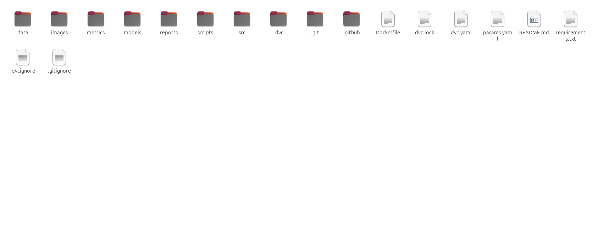
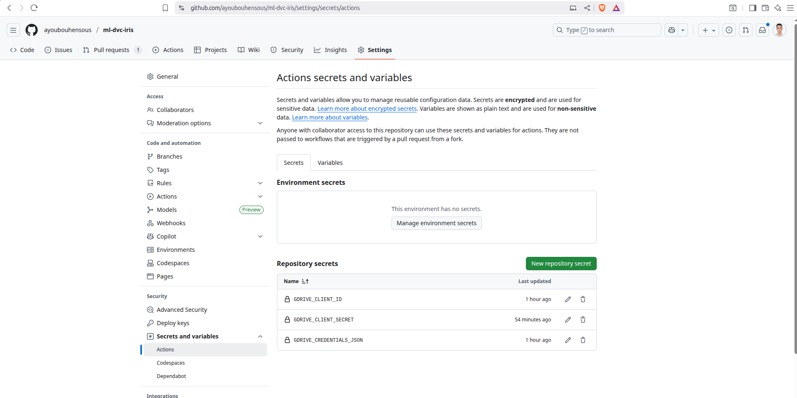
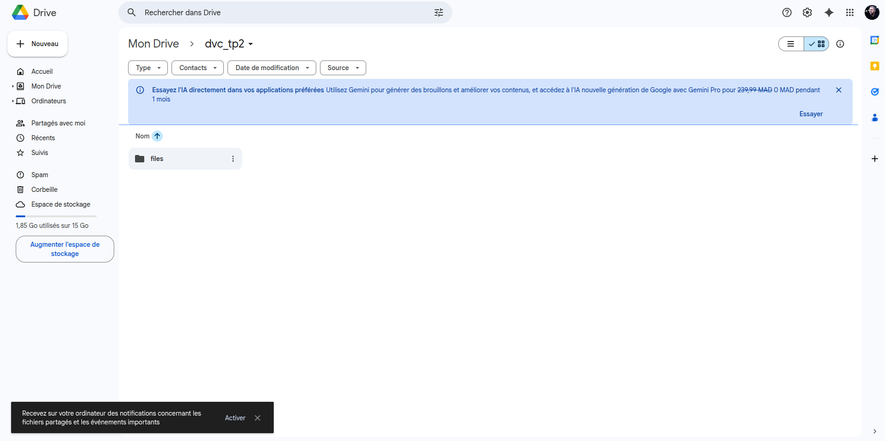
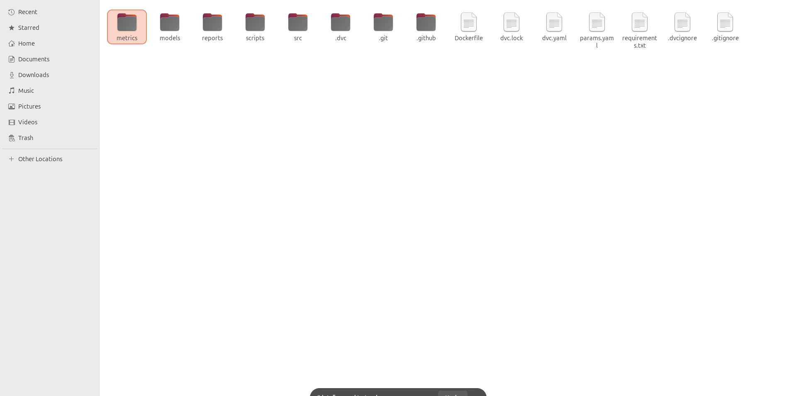
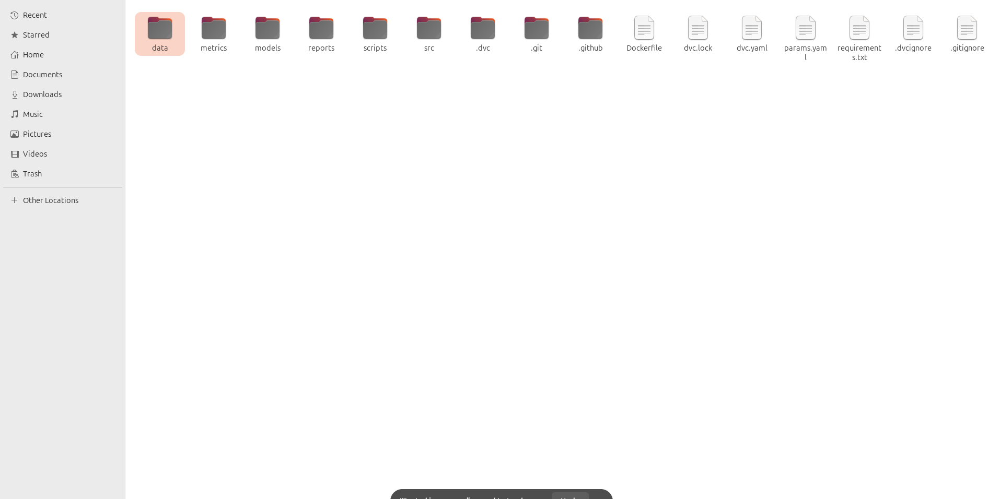
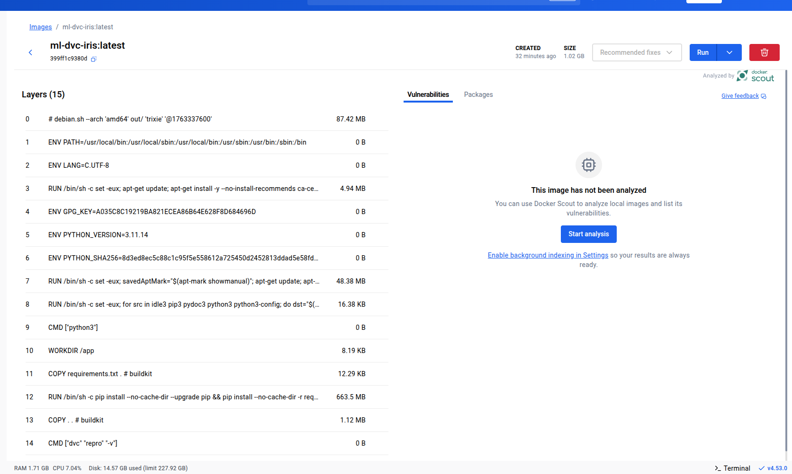
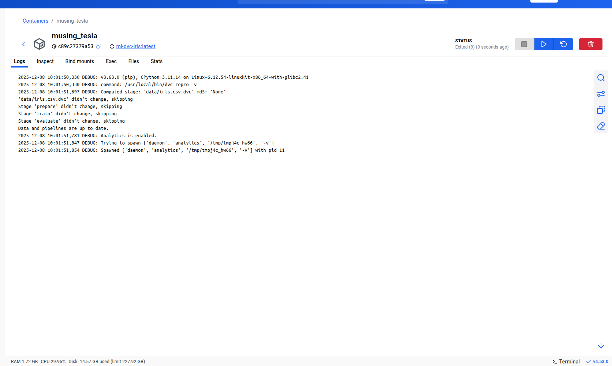
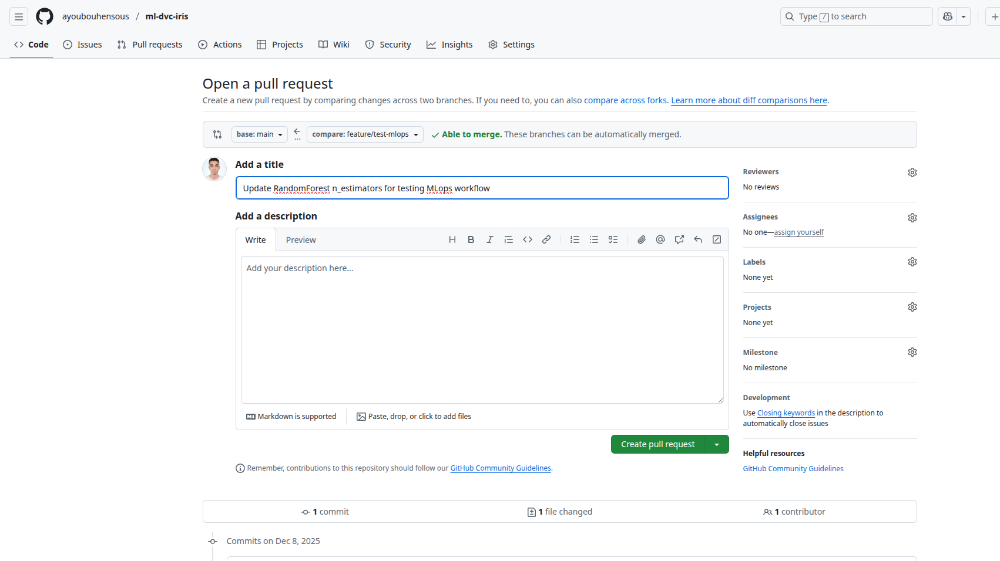
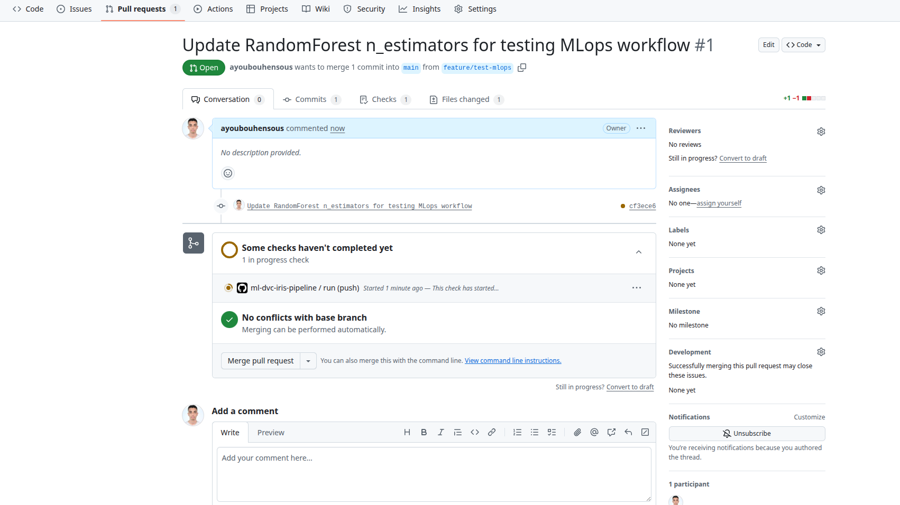
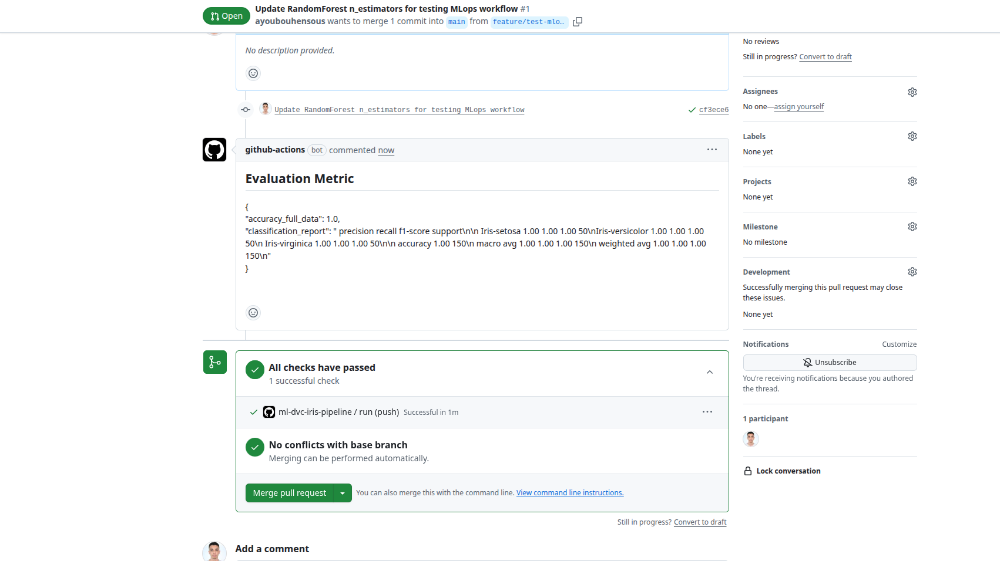

# ml-dvc-iris — Pipeline MLOps complet avec DVC, GitHub Actions, CML et Docker
  

## Contexte
Ce projet a été développé de zéro comme un projet MLOps basé sur le dataset **Iris**.  
L'objectif principal est de mettre en place un pipeline complet permettant :

1. La récupération et le prétraitement des données.
2. L'entraînement d'un modèle **RandomForest**.
3. L'évaluation du modèle et la sauvegarde des métriques.
4. L'intégration dans un workflow **MLOps** avec **DVC**, **GitHub Actions**, **CML**, et **Docker**.
5. La possibilité de versionner les données et modèles via un remote DVC sur **Google Drive**.

---

## Structure du projet

```

ml-dvc-iris/
├─ data/                       # Contient iris.csv et iris_preprocessed.csv
├─ models/                     # Modèles entraînés (.pkl)
├─ metrics/                    # Métriques d'entraînement et d'évaluation
├─ reports/                    # Rapports CML générés
├─ scripts/                    # Scripts Python pour traitement, training, évaluation
│   ├─ download_iris.py
│   ├─ prepare_data.py
│   ├─ train.py
│   ├─ evaluate.py
├─ params.yaml                 # Hyperparamètres et chemins
├─ requirements.txt            # Librairies Python
├─ dvc.yaml / dvc.lock          # Pipeline DVC
└─ Dockerfile                  # Containerisation du pipeline

````


---

## 1. Prétraitement des données

Le prétraitement est géré par le script **`scripts/prepare_data.py`** :

### Fonctionnement
1. Vérifie que le fichier brut `data/iris.csv` existe (sinon lance `download_iris.py`).
2. Sépare les features et la cible (`target`).
3. Standardise les colonnes numériques avec `StandardScaler`.
4. Sauvegarde le dataset prétraité dans `data/iris_preprocessed.csv`.

### Exemple d'exécution
```bash
python scripts/prepare_data.py
````

**Output attendu :**

```
Dataset prétraité sauvegardé dans data/iris_preprocessed.csv
```

---

## 2. Téléchargement des données brutes

Le script **`scripts/download_iris.py`** télécharge le dataset Iris depuis scikit-learn et le sauvegarde localement.

### Fonctionnement

1. Charge le dataset Iris via `sklearn.datasets.load_iris`.
2. Transforme en DataFrame.
3. Sauvegarde en CSV : `data/iris.csv`.

### Exemple d'exécution

```bash
python scripts/download_iris.py
```

**Output attendu :**

```
Dataset Iris sauvegardé dans data/iris.csv
```

---

## 3. Entraînement du modèle

Le script **`scripts/train.py`** permet d’entraîner un modèle **RandomForest**.

### Fonctionnement

1. Charge les hyperparamètres depuis `params.yaml` :

   * `n_estimators`, `max_depth`, `random_state`, etc.
2. Lit les données prétraitées (`data/iris_preprocessed.csv`).
3. Sépare train / test selon `test_size`.
4. Entraîne un `RandomForestClassifier`.
5. Sauvegarde :

   * Le modèle entraîné dans `models/random_forest.pkl`
   * Les métriques d'entraînement dans `metrics/train_metrics.json` (accuracy sur test, paramètres)

### Exemple d'exécution

```bash
python scripts/train.py
```

**Output attendu :**

```
Modèle entraîné sauvegardé dans: models/random_forest.pkl
Métriques d'entraînement sauvegardées dans: metrics/train_metrics.json
Accuracy (test): 0.9733
```

---

## 4. Évaluation du modèle

Le script **`scripts/evaluate.py`** permet de calculer les métriques sur **toutes les données**.

### Fonctionnement

1. Charge les hyperparamètres et chemins depuis `params.yaml`.
2. Lit le dataset complet `data/iris_preprocessed.csv`.
3. Charge le modèle entraîné `models/random_forest.pkl`.
4. Prédit sur l’ensemble des données et calcule :

   * Accuracy globale
   * Classification report détaillé
5. Sauvegarde les métriques dans `metrics/eval_metrics.json`.

### Exemple d'exécution

```bash
python scripts/evaluate.py
```

**Output attendu :**

```
Métriques d'évaluation sauvegardées dans: metrics/eval_metrics.json
Accuracy (données complètes): 0.9733
```

---

## 5. Paramètres et chemins (`params.yaml`)

```yaml
train:
  n_estimators: 150
  max_depth: 5
  random_state: 42
  test_size: 0.2
  target_col: "target"

paths:
  data: "data/iris_preprocessed.csv"
  model: "models/random_forest.pkl"
  metrics_train: "metrics/train_metrics.json"
  metrics_eval: "metrics/eval_metrics.json"
```

* **train** : paramètres d’entraînement du RandomForest.
* **paths** : chemins vers les fichiers de données, modèles et métriques.

---

## 6. Pipeline DVC

* Chaque script peut être intégré dans un pipeline DVC (`dvc.yaml`) :

  ```yaml
  stages:
    download:
      cmd: python scripts/download_iris.py
      outs:
        - data/iris.csv
    prepare:
      cmd: python scripts/prepare_data.py
      deps:
        - data/iris.csv
      outs:
        - data/iris_preprocessed.csv
    train:
      cmd: python scripts/train.py
      deps:
        - data/iris_preprocessed.csv
      outs:
        - models/random_forest.pkl
      metrics:
        - metrics/train_metrics.json
    evaluate:
      cmd: python scripts/evaluate.py
      deps:
        - data/iris_preprocessed.csv
        - models/random_forest.pkl
      metrics:
        - metrics/eval_metrics.json
  ```
* **Commandes DVC utiles** :

```bash
dvc repro          # Exécute tout le pipeline
dvc add data/       # Tracker les données
dvc push            # Pousser sur remote
dvc pull            # Récupérer depuis remote
```

---

Bien sûr ! Voici une version détaillée et adaptée de la **partie 7** pour ton README, incluant l’explication du **remote DVC sur Google Drive** :

---

Parfait ! Voici la **partie 7 mise à jour** avec l’explication du **test de suppression locale** et l’ajout de l’emplacement pour la capture d’écran :

---

## 7. Workflow GitHub Actions & CML avec DVC et Google Drive

Le workflow GitHub Actions exécute automatiquement le pipeline DVC à chaque **push** ou **Pull Request** et publie un rapport avec CML.

### Fonctionnement

1. **Installation des dépendances**

   * Python 3.11
   * DVC (avec support Google Drive)
   * CML
   * Librairies du projet (pandas, scikit-learn, yaml, joblib, etc.)

2. **Connexion au remote DVC sur Google Drive**

   * Le projet utilise un **remote DVC configuré sur Google Drive** pour stocker les données et modèles.
   * L’ID du dossier Google Drive est :
     [https://drive.google.com/drive/folders/1lpWbBYEeopXY8ncYAEsD6bTisTuN6PNL?dmr=1&ec=wgc-drive-globalnav-goto](https://drive.google.com/drive/folders/1lpWbBYEeopXY8ncYAEsD6bTisTuN6PNL?dmr=1&ec=wgc-drive-globalnav-goto)
   * Dans le workflow GitHub Actions, les secrets GitHub (`GDRIVE_CREDENTIALS_JSON`, `GDRIVE_CLIENT_ID`, `GDRIVE_CLIENT_SECRET`) sont utilisés pour authentifier DVC et accéder au dossier.

   **Capture d’écran des secrets GitHub** :  
   


3. **Étapes du workflow**

   * `dvc pull` : récupère les données et modèles depuis Google Drive.
   * `dvc repro` : exécute le pipeline complet (`prepare → train → evaluate`).
   * `scripts/generate_cml_report.py` : lit les métriques JSON et génère un rapport Markdown.
   * `cml comment create report.md` : poste automatiquement le rapport dans la Pull Request.

4. **Test end-to-end de récupération des fichiers**

   * Pour vérifier que le remote fonctionne correctement, nous avons supprimé localement un fichier de sortie (`iris_preprocessed.csv`) ou le dossier `data/`.
   * Ensuite, l’exécution de `dvc pull` a permis de **récupérer automatiquement les fichiers supprimés depuis Google Drive**.
   * Cette étape garantit que toutes les données et artefacts peuvent être restaurés en cas de perte locale.

### Exemple de commandes dans le workflow

```yaml
- name: Configure DVC remote for Google Drive
  run: |
    echo '${{ secrets.GDRIVE_CREDENTIALS_JSON }}' > gdrive_user_credentials.json
    dvc remote modify --local gdrive_remote gdrive_user_credentials_file gdrive_user_credentials.json
    dvc remote modify --local gdrive_remote gdrive_client_id "${{ secrets.GDRIVE_CLIENT_ID }}"
    dvc remote modify --local gdrive_remote gdrive_client_secret "${{ secrets.GDRIVE_CLIENT_SECRET }}"
    dvc remote list

- name: Pull data & models from DVC remote
  run: dvc pull -v
```

### Captures d’écran à prévoir

1. **Contenu du dossier Google Drive** : 

2. **Test de suppression locale + récupération via `dvc pull`** :
   1️⃣ **Suppression locale du dossier `data/`**  
Avant de récupérer les fichiers depuis DVC, on supprime le dossier `data/` pour simuler une perte locale :  


2️⃣ **Récupération des fichiers avec `dvc pull`**  
Après avoir lancé `dvc pull`, les fichiers manquants sont récupérés correctement depuis le remote :  



---


## 8. Containerisation Docker

* **Dockerfile** :

```dockerfile
FROM python:3.11-slim

WORKDIR /app

COPY requirements.txt .
RUN pip install --upgrade pip
RUN pip install --no-cache-dir -r requirements.txt

COPY . .

CMD ["dvc", "repro", "-v"]
```

* Construire et tester :

```bash
docker build -t ml-dvc-iris:latest .
docker run --rm ml-dvc-iris:latest
```






---

## 10. Test end-to-end Pull Request

* Créer une branche de test :

```bash
git checkout -b feature/test-mlops
# Modifier n_estimators à 200 dans params.yaml
git add params.yaml
git commit -m "Test modification n_estimators"
git push -u origin feature/test-mlops
```

* Ouvrir une PR vers `main`
* Vérifier :

  * Exécution automatique du workflow
  * Pipeline DVC complet
  * Commentaire CML avec métriques

Pour vérifier que toute la chaîne CI s’exécute automatiquement, nous avons procédé à un test avec une Pull Request.

1️⃣ **Création de la Pull Request**  
Nous avons créé une branche de test `feature/test-mlops` et ouvert une PR vers `main`.  
Cette PR est nommée **PR** :  


2️⃣ **Workflow en cours d’exécution**  
Après l’ouverture de la PR, le workflow GitHub Actions s’exécute automatiquement, reproduisant le pipeline DVC (`dvc repro`) et générant les métriques.  
Cette étape est représentée par **PR1** :  


3️⃣ **Résultat final et métriques**  
Une fois le pipeline terminé avec succès, un commentaire CML est ajouté automatiquement à la PR avec les résultats et métriques du modèle.  
Cette étape correspond à **PR2** :  



---

## 11. Conclusion

* Pipeline MLOps fonctionnel localement et sur GitHub Actions
* Artefacts versionnés avec DVC et stockés sur Google Drive
* Modèle entraîné et évalué
* Containerisation avec Docker prête à l’usage
* Workflow end-to-end validé sur Pull Request


